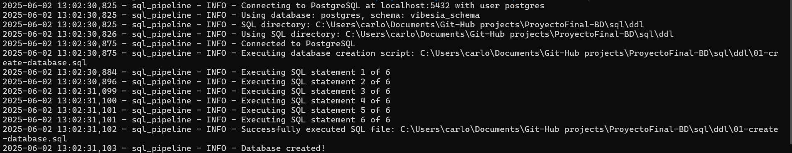
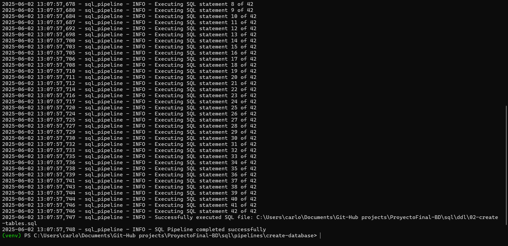

# Pipeline to Automate SQL Script Execution in PostgreSQL

This Python script automates the execution of SQL files to create databases, schemas, and tables in PostgreSQL. It's especially useful for quickly setting up the **musicdb** database environment for a credit card system.

## Requirements

- Python 3.6 or higher  
- `psycopg2` library for PostgreSQL connection

## Installation

1. Make sure you have Python installed on your system.
2. Install the dependencies:

```bash
pip install psycopg2-binary
```

## File Structure

The script automatically searches for the following SQL files:

1. `01-create-database.sql` – Creates the user, database, and schema
2. `02-create-tables.sql` – Creates the system tables

The files should be in the directory specified by `--sql-dir` or, if omitted, will be automatically searched in the project structure (for example, `scripts/ddl`).

---

## 🔄 Two-Step Execution

1. To run your script, navigate to the path where you have the script, which is `pipelines/pipeline-create-auto/`.
2. Activate your virtual environment `.\venv\Scripts\activate` and make sure the dependencies in the _Installation_ step are correctly installed.
3. Test the `test_connection` script to validate if your script and local connection is successful as follows:
   
    **Console**
    ```shell
    python .\test_connection.py localhost 5432 postgres your_password
    ``` 
    **Console Output**
    ```shell
    === Testing PostgreSQL Connection ===
    Host: localhost
    Port: 5432
    User: postgres
    Password: *********
    System locale: cp1252
    Python version: 3.13.3 (tags/v3.13.3:6280bb5, Apr  8 2025, 14:47:33) [MSC v.1943 64 bit (AMD64)]

    Attempting connection method 1 (keyword arguments)...
    ✅ Connection successful (Method 1)!

    Attempting connection method 2 (connection string)...
    ✅ Connection successful (Method 2)!

    Attempting connection method 3 (URI)...
    ✅ Connection successful (Method 3)!
    ```

4. After validating that the user can connect, comes the complete creation of the database and its tables. To achieve this, execution must be done in **two independent steps**, one with the administrator user (`postgres`) and another with the new application user (`music_admin`):
   1. **🧩 Step 1: Create the database and schema (as `postgres`)**
        
        Execute the following script, in a single line in the current terminal, which has the virtual environment active and in the same path:
      ```bash
      python sql_pipeline_auto.py --user postgres --password "your_password" --db-name postgres --sql-dir ../../sql/ddl --use-sql-for-db-creation
      ```
      **Console Output**

      

      ```shell
      2025-06-02 13:02:30,825 - sql_pipeline - INFO - Connecting to PostgreSQL at localhost:5432 with user postgres
      2025-06-02 13:02:30,825 - sql_pipeline - INFO - Using database: postgres, schema: vibesia_schema
      2025-06-02 13:02:30,825 - sql_pipeline - INFO - SQL directory: C:\Users\carlo\Documents\Git-Hub projects\ProyectoFinal-BD\sql\ddl
      2025-06-02 13:02:30,826 - sql_pipeline - INFO - Using SQL directory: C:\Users\carlo\Documents\Git-Hub projects\ProyectoFinal-BD\sql\ddl
      2025-06-02 13:02:30,875 - sql_pipeline - INFO - Connected to PostgreSQL
      2025-06-02 13:02:30,875 - sql_pipeline - INFO - Executing database creation script: C:\Users\carlo\Documents\Git-Hub        projects\ProyectoFinal-BD\sql\ddl\01-create-database.sql
      2025-06-02 13:02:30,884 - sql_pipeline - INFO - Executing SQL statement 1 of 6
      2025-06-02 13:02:30,896 - sql_pipeline - INFO - Executing SQL statement 2 of 6
      2025-06-02 13:02:31,099 - sql_pipeline - INFO - Executing SQL statement 3 of 6
      2025-06-02 13:02:31,100 - sql_pipeline - INFO - Executing SQL statement 4 of 6
      2025-06-02 13:02:31,101 - sql_pipeline - INFO - Executing SQL statement 5 of 6
      2025-06-02 13:02:31,101 - sql_pipeline - INFO - Executing SQL statement 6 of 6
      2025-06-02 13:02:31,102 - sql_pipeline - INFO - Successfully executed SQL file: C:\Users\carlo\Documents\Git-Hub        projects\ProyectoFinal-BD\sql\ddl\01-create-database.sql
      2025-06-02 13:02:31,103 - sql_pipeline - INFO - Database created!
      ``` 
    - Open a connection from SQL-Shell 
    ```bash
      psql -U music_admin -d musicdb -p 5432
      ```
    - Validate if the database and user were created with the following query:
      ```sql
      SELECT 'role' AS type, rolname AS name
      FROM pg_roles
      WHERE rolname = 'music_admin'

      UNION ALL

      SELECT 'database' AS type, datname AS name
      FROM pg_database
      WHERE datname = 'musicdb'

      UNION ALL

      SELECT 'schema' AS type, schema_name AS name
      FROM information_schema.schemata
      WHERE schema_name = 'vibesia_schema';
      ```
      **Console Output**
      ```shell
        type     |      name
        ----------+---------------
        role     | music_admin
        database | musicdb
        schema   | vibesia_schema
        (2 rows)
      ```
   - This step executes `01-create-database.sql` within the `postgres` database. Here it creates:

     - The new user (`music_admin`)
     - The `musicdb` database
     - The `vibesia_schema` schema in that database
     - Optional comments
---
   2. **🧩 Step 2: Create tables and load data (as `music_admin`)**
        
        Execute the following script, in a single line in the current terminal, which has the virtual environment active and in the same path:
      ```bash
      python sql_pipeline_auto.py --user music_admin --password "YOUR PASSWORD" --db-name musicdb --sql-dir ../../ddl
      ```

      **Console Output**

      

      ```shell
      2025-06-02 13:07:57,629 - sql_pipeline - INFO - Executing SQL statement 1 of 42
      2025-06-02 13:07:57,649 - sql_pipeline - INFO - Executing SQL statement 2 of 42
      2025-06-02 13:07:57,654 - sql_pipeline - INFO - Executing SQL statement 3 of 42
      2025-06-02 13:07:57,661 - sql_pipeline - INFO - Executing SQL statement 4 of 42
      2025-06-02 13:07:57,665 - sql_pipeline - INFO - Executing SQL statement 5 of 42
      2025-06-02 13:07:57,671 - sql_pipeline - INFO - Executing SQL statement 6 of 42
      2025-06-02 13:07:57,675 - sql_pipeline - INFO - Executing SQL statement 7 of 42
      2025-06-02 13:07:57,678 - sql_pipeline - INFO - Executing SQL statement 8 of 42
      2025-06-02 13:07:57,680 - sql_pipeline - INFO - Executing SQL statement 9 of 42
      2025-06-02 13:07:57,684 - sql_pipeline - INFO - Executing SQL statement 10 of 42
      2025-06-02 13:07:57,687 - sql_pipeline - INFO - Executing SQL statement 11 of 42
      2025-06-02 13:07:57,692 - sql_pipeline - INFO - Executing SQL statement 12 of 42
      2025-06-02 13:07:57,698 - sql_pipeline - INFO - Executing SQL statement 13 of 42
      2025-06-02 13:07:57,700 - sql_pipeline - INFO - Executing SQL statement 14 of 42
      2025-06-02 13:07:57,703 - sql_pipeline - INFO - Executing SQL statement 15 of 42
      2025-06-02 13:07:57,705 - sql_pipeline - INFO - Executing SQL statement 16 of 42
      2025-06-02 13:07:57,706 - sql_pipeline - INFO - Executing SQL statement 17 of 42
      2025-06-02 13:07:57,708 - sql_pipeline - INFO - Executing SQL statement 18 of 42
      2025-06-02 13:07:57,710 - sql_pipeline - INFO - Executing SQL statement 19 of 42
      2025-06-02 13:07:57,711 - sql_pipeline - INFO - Executing SQL statement 20 of 42
      2025-06-02 13:07:57,712 - sql_pipeline - INFO - Executing SQL statement 21 of 42
      2025-06-02 13:07:57,714 - sql_pipeline - INFO - Executing SQL statement 22 of 42
      2025-06-02 13:07:57,716 - sql_pipeline - INFO - Executing SQL statement 23 of 42
      2025-06-02 13:07:57,717 - sql_pipeline - INFO - Executing SQL statement 24 of 42
      2025-06-02 13:07:57,720 - sql_pipeline - INFO - Executing SQL statement 25 of 42
      2025-06-02 13:07:57,724 - sql_pipeline - INFO - Executing SQL statement 26 of 42
      2025-06-02 13:07:57,725 - sql_pipeline - INFO - Executing SQL statement 27 of 42
      2025-06-02 13:07:57,727 - sql_pipeline - INFO - Executing SQL statement 28 of 42
      2025-06-02 13:07:57,729 - sql_pipeline - INFO - Executing SQL statement 29 of 42
      2025-06-02 13:07:57,730 - sql_pipeline - INFO - Executing SQL statement 30 of 42
      2025-06-02 13:07:57,732 - sql_pipeline - INFO - Executing SQL statement 31 of 42
      2025-06-02 13:07:57,733 - sql_pipeline - INFO - Executing SQL statement 32 of 42
      2025-06-02 13:07:57,735 - sql_pipeline - INFO - Executing SQL statement 33 of 42
      2025-06-02 13:07:57,736 - sql_pipeline - INFO - Executing SQL statement 34 of 42
      2025-06-02 13:07:57,738 - sql_pipeline - INFO - Executing SQL statement 35 of 42
      2025-06-02 13:07:57,739 - sql_pipeline - INFO - Executing SQL statement 36 of 42
      2025-06-02 13:07:57,741 - sql_pipeline - INFO - Executing SQL statement 37 of 42
      2025-06-02 13:07:57,743 - sql_pipeline - INFO - Executing SQL statement 38 of 42
      2025-06-02 13:07:57,744 - sql_pipeline - INFO - Executing SQL statement 39 of 42
      2025-06-02 13:07:57,744 - sql_pipeline - INFO - Executing SQL statement 40 of 42
      2025-06-02 13:07:57,746 - sql_pipeline - INFO - Executing SQL statement 41 of 42
      2025-06-02 13:07:57,746 - sql_pipeline - INFO - Executing SQL statement 42 of 42
      2025-06-02 13:07:57,747 - sql_pipeline - INFO - Successfully executed SQL file: C:\Users\carlo\Documents\Git-Hub       projects\ProyectoFinal-BD\sql\ddl\02-create-tables.sql
      2025-06-02 13:07:57,748 - sql_pipeline - INFO - SQL Pipeline completed successfully
      ```
      - Open a connection from SQL-Shell and connect with the `music_admin` user and the `musicdb` database and validate if the tables are created in the schema with the following query:
      - Or from terminal with the following command:
      ```bash
      psql -U music_admin -d musicdb -p 5432
      ```
  
        ```sql
        SELECT table_schema, table_name
        FROM information_schema.tables
        WHERE table_schema = 'vibesia_schema';
        ```
        **Console Output**
          ```shell
              table_schema  |    table_name
            ----------------+------------------
            vibesia_schema | playlist_songs
            vibesia_schema | users
            vibesia_schema | song_genres
            vibesia_schema | genres
            vibesia_schema | playlists
            vibesia_schema | devices
            vibesia_schema | playback_history
            vibesia_schema | user_device
            vibesia_schema | albums
            vibesia_schema | audit_log
            vibesia_schema | artists
            vibesia_schema | songs
            (12 rows)
          ```
   - This step connects directly to the `musicdb` database and executes:

     - `02-create-tables.sql` to create the tables and `04-alter-tabbles` to edit tables.
---

## Available Options

- `--host`: PostgreSQL host (default: localhost)
- `--port`: PostgreSQL port (default: 5432)
- `--user`: PostgreSQL user (required)
- `--password`: User password (required)
- `--db-name`: Database to use or create (default: fintech_cards)
- `--schema-name`: Schema to create or use (default: fintech)
- `--sql-dir`: Path where SQL files are located (default: automatic search)
- `--use-sql-for-db-creation`: Executes the `01-create-database.sql` file as part of the process

---

## Important Notes

- **Don't execute both steps with the same user**: the first step requires administrative privileges (`postgres`) and the second, the created user (`music_admin`).
- If `01-create-database.sql` doesn't exist, the script can create the database and schema directly from code (alternative mode).
- For greater security, use environment variables for credentials.