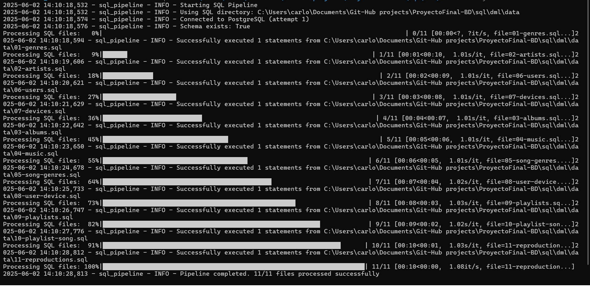

# Vibesia Data Insertion Pipeline

This project provides an automated workflow to efficiently populate the `Vibesia` music database using bulk-insert optimized SQL files. It consists of two main components:

- **Conversion Script**: Transforms individual `INSERT` statements into batched transactions.
- **Execution Pipeline**: Sequentially executes the SQL files against a PostgreSQL database.

---

## Prerequisites

- PostgreSQL instance with the `vibesia_schema` schema already created.
- Python 3.6 or later installed.
- Required Python packages:

```bash
pip install psycopg2-binary tqdm
```

---

## Step 1: Convert to Bulk INSERTs

The `sql_bulk_insert.py` script scans SQL files containing thousands of individual `INSERT` statements and converts them into batch-formatted transactions, improving performance and network efficiency.

### Why Bulk Inserts?

- 🚀 **Faster insertions** — batches are up to 10x more efficient.
- 📦 **Fewer transactions** — grouped `BEGIN/COMMIT` blocks.
- 🌐 **Reduced network overhead** — fewer roundtrips to the DB server.
- 💾 **Better resource usage** — reduces CPU and memory usage.

> Note: Only heavy-load files should be converted. Smaller files (e.g., with <100 inserts) can be skipped
> Note: it's unnecessary to convert them for the content data in the GitHub project.

### Usage

```bash
python sql_bulk_insert.py --batch-size 10000
```

### Parameters

| Parameter       | Description                               | Default                   |
|-----------------|-------------------------------------------|---------------------------|
| `--batch-size`  | Number of records per batch               | 10000                     |

### Output
Bulk-insert SQL files are generated in the `Bulk-Load/` subdirectory, one per original file. Example format:

```sql
BEGIN;
INSERT INTO table_name (col1, col2, ...) VALUES
  (val1_1, val1_2, ...),
  (val2_1, val2_2, ...),
  ...
  (valN_1, valN_2, ...);
COMMIT;
```

---

## Step 2: Run the Data Pipeline

The `sql_insert_pipeline_auto.py` script loads all standard and bulk SQL files into the database. It supports error handling, connection retries, per-file transaction control, and progress indicators.

### Usage

```bash
python sql_insert_pipeline_auto.py --user music_admin --password "YOUR PASSWORD" --db-name musicdb --sql-dir ../../../sql/dml/data --delay 1.0
```

### Parameters

| Parameter         | Description                            | Default           |
|-------------------|----------------------------------------|-------------------|
| `--host`          | PostgreSQL host                        | `localhost`       |
| `--port`          | PostgreSQL port                        | `5432`            |
| `--user`          | Database username                      | *(required)*      |
| `--password`      | Database password                      | *(required)*      |
| `--db-name`       | Target database                        | `musicdb`         |
| `--schema-name`   | Schema to validate before inserting    | `vibesia_schema`  |
| `--sql-dir`       | Path to the SQL files                  | `.`               |
| `--max-retries`   | Max DB connection attempts             | `3`               |
| `--delay`         | Delay (in seconds) between file loads  | `1.0`             |

### Output



---


## Step 3: Validate Inserted Records

To verify that all records were inserted correctly, run a SQL validation query after pipeline execution.

### Connect to PostgreSQL

```bash
psql -U music_admin -d musicdb
```

### Example Validation Query

```sql
SELECT 'genres' AS table_name, COUNT(*) FROM vibesia_schema.genres
UNION ALL
SELECT 'artists', COUNT(*) FROM vibesia_schema.artists
UNION ALL
SELECT 'albums', COUNT(*) FROM vibesia_schema.albums
UNION ALL
SELECT 'songs', COUNT(*) FROM vibesia_schema.songs
UNION ALL
SELECT 'users', COUNT(*) FROM vibesia_schema.users
UNION ALL
SELECT 'devices', COUNT(*) FROM vibesia_schema.devices
UNION ALL
SELECT 'user_device', COUNT(*) FROM vibesia_schema.user_device
UNION ALL
SELECT 'playlists', COUNT(*) FROM vibesia_schema.playlists
UNION ALL
SELECT 'playlist_songs', COUNT(*) FROM vibesia_schema.playlist_songs
UNION ALL
SELECT 'song_genres', COUNT(*) FROM vibesia_schema.song_genres
UNION ALL
SELECT 'playback_history', COUNT(*) FROM vibesia_schema.playback_history
ORDER BY table_name;
```
### Sample Output (Record Count per Table)

```bash
 table_name       | count 
------------------+-------
 albums           |    20
 artists          |    20
 devices          |    20
 genres           |    20
 playback_history |    75
 playlist_songs   |   100
 playlists        |    21
 song_genres      |    71
 songs            |    40
 user_device      |    25
 users            |    20
(11 rows)
```
---

## File Structure

PROYECTOFINAL-BD/
├── docs/
│ └── modelos/
│ ├── ERD/ # Entity-Relationship Diagrams
│ ├── LDM/ # Logical Data Model
│ ├── PDM/ # Physical Data Model
│ └── diccionario_datos.xlsx # Data dictionary
│
├── sql/
│ ├── ddl/ # DDL scripts (schema definition)
│ │ ├── 01-create-database.sql
│ │ ├── 02-create-tables.sql
│ │ ├── 03-create-triggers.sql
│ │ ├── 04-altert-tables.sql
│ │ └── 05-procedures-storage-...
│ │
│ ├── dml/ # DML scripts (data manipulation)
│ │ ├── audit/ # Audit-related insertions or configurations
│ │ ├── data/ # Seed or bulk data insertion
│ │ └── procedures-storage-calls/ # Calls to procedures or function executions
│
├── pipelines/ # Python scripts for automation (e.g. bulk inserts)
│
├── queries/ # Custom SQL queries and validations
│
├── .gitignore
└── README.md

---

## Key Features

- 🔄 **Automatic batch conversion**
- 🔗 **Robust PostgreSQL connection with retry logic**
- 📂 **Transaction handling per file and per batch**
- 📊 **Progress bars and detailed logging**
- 🛑 **Stops on error and performs rollback**
- 📋 **Validation-ready output**

---

## Troubleshooting

- Ensure all expected SQL files are present in `--sql-dir`.
- Check your DB schema (`vibesia_schema`) exists before starting.
- If any script fails, inspect the logs for the failing statement.
- If you have problems on the execution scripts like warning delete all comments in the sql files(5,10,11)
- Increase `--max-retries` for unreliable connections.

---

## Final Notes

- Always run the conversion step (`sql_bulk_insert.py`) executing the pipeline.
- Maintain file naming order to preserve foreign key consistency.
- Ensure the database user has sufficient privileges for DML operations.
